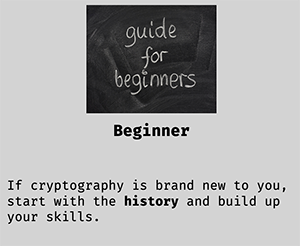

## Table of contents
- [Technologies](#Technologies)
- [Introduction](#Introduction)
- [Requirements](#Requirements)
- [Features](#Features)
- [Installation and Usage](#Installation-and-Usage)
- [Collaborators](#Collaborators)

## Technologies
### Communications
- Teams
- Discord
### Activity Board
- Trello
### Hosting and Version Control
- GitHub
### Front-end Development
- HTML
- CSS
- JS
### Back-end Development
- JS
- Python
- Mongo-DB

## Introduction
There is no singular location to find out about topics surrounding cryptography. deCrypt Me merges everything together to give you all the information you would need into a nice and consice location.

## Requirements
A browser with JavaScript enabled. If you are running a JavaScript blocking plug-in such as NoScript then please trust uwillnvrknow.github.io.

deCrypt Me has been designed to support most browsers.

## Features
The site features many different aspects that will allow you to learn about cryptography. This includes:
- Different routes catered to your specific skill set.
- Audio recordings to complement some sections on the site.
- Python based Extended Euclidean Algorithm calculator
- Quiz system for most sections
- Content always expanding

## Installation and Usage
No installation required! Just boot up a browser and [visit us](https://uwillnvrknow.github.io/deCryptMe/index.html)

Our landing page will offer you four options:

 
 
 

Pick from the routes to ensure that you're within your comfort zone, the site will push you to your limits as you progress! You can also navigate to individual pages using our fancy navigation bar.

On certain pages you will also find audio controls at the top, you can use these to stop and start the voice recordings which will bring the articles to life. Currently this feature only exists on the Crypto Wars section, we will extend this in the future.

Cryptographic functions have been broken down and completed by hand so you can follow along step by step. From the Euclidean Algorithm to AES and Quantum, we have you covered. 

Try your own examples from the Bezout's Algorithm and use the calculator on the page to check if your solutions are right!

Our (coming soon) FAQ page will answer most questions you will have, but should you have a question not listed, visit the contact page to send us a message or email us
<deCrypt-Me@outlook.com>.

Where sources have been used to create articles, they have been listed using Harvard in the HTML comment of each page.

## Collaborators
- Jane - Front-end developer and Maths

- Harry - Front-end developer and History

- Chelsea - Quality Control and Maths

- James - Back-end developer

- Kendal - History

- Louise - Maths and Theory

- Abby - Maths and Theory

- Isaac - Theory

---
##### readme written by HarryIsSecured